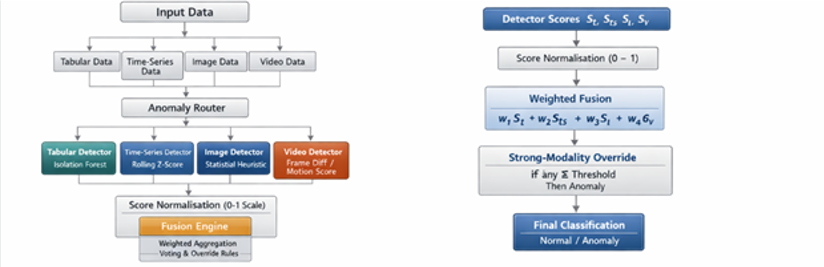
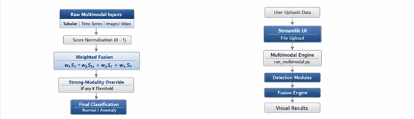

# Multimodal Anomaly Detection System

This repository contains my Final Year Project (FYP): a modular **multimodal anomaly detection system** that combines evidence from **tabular data, time-series data, images, and video** into one interpretable anomaly decision.

The project was developed as both a working software system and an academic investigation into how heterogeneous anomaly signals can be made comparable through **score normalisation, calibration, and decision-level fusion**.

## Overview

The system works by:

- processing each available modality with a dedicated detector
- producing a raw anomaly score for that modality
- converting scores into a shared normalised or calibrated range
- combining the available modality scores through fusion
- returning a final label, fused score, and explanation

Only the modalities provided by the user are analysed in each run.

## Architecture and Workflow

  


## Current Capabilities

### Tabular
- Isolation Forest for numeric tabular anomaly detection
- float support for numeric input
- mixed tabular CSV mode for numeric and categorical data
- single-table row anomaly detection
- support for both manual examples and uploaded CSV workflows
- fusion-ready anomaly scoring
- calibration support via `models/tabular_calibration.json`

### Time-Series
- rolling z-score anomaly detection
- short-window spike detection
- manual sequence input via dashboard
- fusion-ready scoring using strongest anomaly signal
- calibration support via `models/timeseries_calibration.json`

### Image
- autoencoder-based anomaly detection (reconstruction error)
- training via `train_image_autoencoder.py`
- automatic model loading from `models/autoencoder.keras`
- autoencoder calibration support
- additional calibration via `models/image_calibration.json`
- fallback statistical scoring when model unavailable
- single-image detection
- multi-image comparison
- group-based anomaly detection via centroid distance

### Video
- frame-difference anomaly detection
- UCSD dataset support
- clip-level scoring using robust percentile summary
- single-video detection
- multi-video comparison
- group-based anomaly detection
- calibration support via `models/video_calibration.json`

## Calibration and Score Comparability

Different modalities produce scores on different scales. To address this, the system includes **modality-specific calibration**.

Calibration improves:
- score comparability
- fusion stability
- interpretability

Calibration files:
- `models/image_calibration.json`
- `models/tabular_calibration.json`
- `models/timeseries_calibration.json`
- `models/video_calibration.json`
- `models/autoencoder_calibration.json`

Run calibration:
```bash
python scripts/run_calibration.py
```

## Fusion

Fusion combines modality outputs using:

- weighted average
- vote-based logic
- strong-modality override
- missing modality handling

The system exposes:
- raw scores
- calibrated scores
- labels
- fused score
- explanation

## Dashboard

The Streamlit dashboard supports:

- tabular (numeric, mixed, single-table)
- time-series input
- image upload and comparison
- video input and comparison
- automatic model loading
- fallback behaviour
- adjustable weights and thresholds
- per-modality outputs
- ranked comparison results
- JSON outputs
- explanation interface

Run dashboard:
```bash
streamlit run dashboard/app.py
```

## Development Summary

### Phase 1 — Research
- literature review
- multimodal anomaly detection study
- Jupyter experimentation

### Phase 2 — Implementation
- modular Python system
- detector development
- fusion and calibration integration

### Phase 3 — Validation
- testing and evaluation
- dashboard development
- comparison features
- system refinement

## Repository Structure

```text
Multimodial Anomaly Detection System/
├── dashboard/
│   └── app.py
├── data/
│   ├── image_train/
│   └── ucsd/
├── images/
│   ├── reference_normal/
│   ├── abnormal_arm.jpg
│   └── normal_arm.jpg
├── models/
│   ├── autoencoder.keras
│   ├── autoencoder_calibration.json
│   ├── image_calibration.json
│   ├── tabular_calibration.json
│   ├── timeseries_calibration.json
│   └── video_calibration.json
├── notebooks/
├── outputs/
├── reports/
├── scripts/
│   ├── run_calibration.py
│   └── run_multimodial.py
├── src/
    ├──common/
        ├── normalise.py
│   ├── anomaly_router.py
│   ├── detection_image.py
│   ├── detection_tabular.py
│   ├── detection_tabular_mixed.py
│   ├── detection_tabular_single_table.py
│   ├── detection_timeseries.py
│   ├── detection_video.py
│   ├── fusion.py
│   ├── fusion_evaluate.py
    ├── detection_video_compare.py
│   ├── detection_image.compare.py
│   ├── plot_video_scores.py
│   ├── plot_video_segments.py
│   └── video_postprocess.py
│   └── run_multimodal.py
├── tests/
├── run_tests.py
├── train_image_autoencoder.py
├── README.md
```

## Running the Project

Run tests:
```bash
python run_tests.py
```

Train image model:
```bash
python train_image_autoencoder.py
```

## Key Strengths

- modular architecture
- interpretable outputs
- multimodal fusion
- calibration support
- comparison modes
- interactive dashboard
- flexible tabular workflows
- practical and explainable design

## Current Limitations

- baseline detectors
- manual fusion tuning
- limited benchmarking
- non-specialised image/video models
- comparison depends on input quality

## Author

**Derek Ohimai Isokpehi**  
University of Birmingham

## Final Note

This project delivers a **complete, interpretable, and extensible multimodal anomaly detection system** combining machine learning, statistical methods, calibration, and fusion.

Its strength lies in system design, explainability, and practical integration across multiple data modalities.

## Reliability-aware research extension

```bash
pip install -r requirements.txt
streamlit run dashboard/research.py
python scripts/run_research.py
python run_tests.py
```

The research lab compares equal, learned fixed and quality-adaptive fusion on aligned event scores using separate calibration, validation and test groups. It includes missing-modality and noise stress tests, a quality-unknown ablation, abstention when evidence is unavailable, and downloadable reproducibility bundles. Upload your own aligned out-of-sample detector scores using the schema in the [protocol](docs/RESEARCH_PROTOCOL.md).

The original `dashboard/app.py` now offers reliability weighting with explicit user-supplied quality sliders. Legacy strong-override fusion remains selectable. TensorFlow is loaded only when a trained image model is present; install `requirements-autoencoder.txt` for that optional path. The legacy summary-list fusion API retains its -1/1 labels, while the dictionary API uses 0/1.

Read the [measured results and limitations](docs/RESEARCH_RESULTS.md): the default data are synthetic and quality adaptation depends on knowing which input is degraded. These measurements are not real-world multimodal detector validation.
# One-command local launch

On Windows with Python 3.13, double-click `Start.cmd`, or run `py -3.13 launch.py` in this folder. Use `py -3.13 launch.py --research-ui` for the fusion research lab. Python 3.12 is also supported. See [quick start and research history](docs/QUICKSTART.md).
